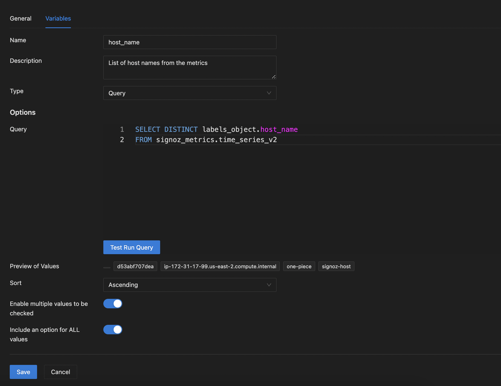
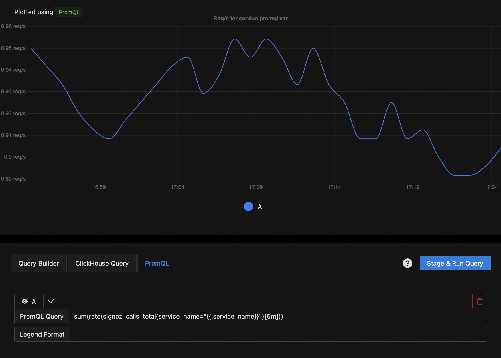

import GetHelp from '../shared/get-help.md'
import PrereqsInstrument from '../shared/prereqs-instrument.md'

## Prerequisites

<PrereqsInstrument />

## Variables

Variables are now supported for the dashboard panel chart for all three query types. The widget plots can make use of these variables and update the charts dynamically without having to update the query for each value. When the value of the variable changes the refreshed dashboard will reflect the new value. Variables allow users to make interactive dashboards. Variables are most commonly used to avoid hard coding the values for host names, Kubernetes pods, namespaces, etc. Variables are independent for each dashboard. Variables are shown using the dropdowns at the top of the dashboard.

## Variables types

SigNoz supports three ways of creating variables: query, custom, and textbox.

1. Query   - A SQL query that can be used to fetch data from ClickHouse server SigNoz configured to use
2. Custom  - A comma-separated list values as a Variable
3. Textbox - A free text input field with an optional default value

## Add a Variable to a Dashboard

To add a variable to a dashboard, follow the steps below:

1. From the sidebar, choose **Dashboards**.
2. Find the dashboard to which you want to add a new variable.
3. Select **Configure**.
4. Select **New Variables** from the **Variables** section tab.
5. Populate the following fields:
    1. **Name**: Name of the variable. This is used in Metrics builder/ClickHouse query/ PromQL later
    2. **Description**: Enter a brief and meaningful description of your variable.
    3. **Type**: Select the variable type from the list of available choices and the UI changes accordingly.
    4. _(Optional)_ **Sort**: Sort the values if applicable from the above variable type.
    5. _(Optional)_ **Enable multiple values to be checked**: Make dropdown multi-select
    6. _(Optional)_ **Include an option for ALL values**: Show the `ALL` option which includes all options from the multi-select dropdown
6.  When you’ve finished, select the **Save** button.

### Examples

The following shows some examples to create a variable with hypothetical scenarios

1. You want to query the list of host names from the metrics database and use them as a variable

    

2. Some list of known endpoints as a variable
    

3. Free text as a variable

    

## Using variables in queries

The following shows some example widget plots using the variables created from the above section

1. Metric Builder

    

2. ClickHouse Query

    

3. PromQL

    

## Get Help

<GetHelp />